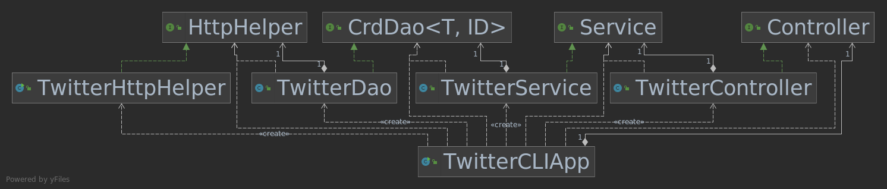

# Introduction
This Java Twitter app is designed to realize the purposes of a Twitter account 
which allows users to search, post and delete tweets via the official Twitter REST APIs. 
A simplified tweet model is created with required dao, service and controller layers to access the tweet 
using HTTP request. 
Mockito and JUnit testing are used for integration and unit testing of this app. Maven dependency model is incorporated to 
add all the necessary Java libraries (mockito, junit, fasterxml, springframework). This app has also been implemented 
with Spring framework and docker.

# Quick Start
A Twitter Developer account with consumer key, consumer secret, access token and token secret 
  is necessary for this app to be functioning.

  Maven: 
  ```
  mvn clean package
  ``` 

  Usage:
  
  ```
  TwitterApp post|show|delete [options]
  ```
  Docker: 
  ```
  docker run --rm \ -e consumerKey=YOUR_VALUE \
  -e consumerSecret=YOUR_VALUE \
  -e accessToken=YOUR_VALUE \
  -e tokenSecret=YOUR_VALUE \
  TwitterApp post|show|delete [options]
  ```

# Design

### TwitterCLIApp
This class declares and instantiates all the components of the app and calls the run method. 
The run method parses the arguments and calls the controller methods and prints the tweet(s) returned 
by the controller methods.
### TwitterController
This class is a controller layer that consumes the user input arguments and calls the corresponding service layer
method. It does not handle any business logic.
### TwitterService
This class is a service layer that handles the business logic of the app. Here, some common business logics have 
only been implemented, e.g., checking a tweet for characters length and latitude/longitude validity and
user id formatting. After validating the business logic, it calls the DAO layer in order to interact 
with the Twitter REST API.
### TwitterDao
This class acts as the DAO layer that handles data with external storage. It is the one that constructs Twitter REST API URIs 
and make HTTP calls using HttpHelper. Here, it is used to save/show/delete tweet(s).
### TwitterHttpHelper
This class is only responsible for executing HTTP requests with a given URI. It also uses Twitter secrets to
authorize the HTTP requests.

## Models
Models are implemented using Plain Old Java Objects (POJOs) which is a class with private member variables and
public getters and setters. This class encapsulates Tweet data which often displays in JSON format.
Here, same object is used as Data Transfer Model (or DTO) and Data access model (or domain model).
A simplified version of the tweet object is created which contains the following properties only:
* Coordinates 
* Entities
* Hashtag
* Tweet
* UserMention
```
{
   "created_at":"Mon Feb 18 21:24:39 +0000 2019",
   "id":1097607853932564480,
   "id_str":"1097607853932564480",
   "text":"test with loc223",
   "entities":{
      "hashtags":[],      
      "user_mentions":[]  
   },
   "coordinates":null,    
   "retweet_count":0,
   "favorite_count":0,
   "favorited":false,
   "retweeted":false
}
```
## Spring
- How you managed the dependencies using Spring?
Spring is used to manage the dependencies. An implementation using @Bean is tested that
  passes the dependencies through method arguments. Next implementation uses @ComponentScan instead of @Bean
  which also requires to specify Beans and dependencies one by one. Another implementation uses @Components  
  which simply tells the IoC Container where to look for Beans.

# Test
Junit test is used with the integration testing for Controller, DAO and Service layers. The purpose is 
to test the class workflow using @Test for each method and Assertions to test the expected and actual results.
</br>
Mockito is used in the app for unit testing to test these layer classes without actually calling the dependencies 
rather mocking them using @Mock to create dummy objects for the dependencies.

## Deployment
A dockerized version of this app has also been generated using docker and saved for easier 
future consumption by pushing the docker image created to the Docker hub account.


# Improvements
- Enhance the performance with increased business logic implementation
- Create the full version of the tweet object and add necessary functionalities
